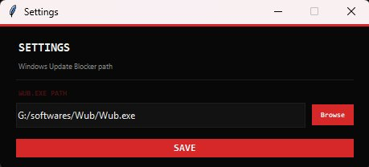

# SaveGuard ⚔

A simple Windows utility I built because certain games (Offline Activated Games) wipe your save file every time they push an update. Tired of losing progress, so I made this.

Set your source and destination once. Never touch it again. One click to back up, one click to restore.


---

## What it does

- **💾 Save Now** — copies your save from the game folder to your backup folder
- **⬆ Restore Now** — puts it back after an update nukes it
- **🎟 Ticket Claim** — launches [Windows Update Blocker](https://www.sordum.org/9470/) as admin so you can stop Windows from auto-updating mid-session
- Remembers your paths forever — set once, done
- Works with both save files and save folders
- If the game creates a new numbered folder after an update, Restore finds it automatically and pastes your files in

---

## Setup

**Download:** grab `SaveGuard.exe` from [Releases](../../releases) and run it. No install, no Python needed.

**First time:**
1. Set **Source** — point it to your game's save folder (or file)
2. Set **Destination** — any folder where you want backups to live
3. Hit **Save Now** before your next update

That's it.

---

## Ticket Claim (optional)

If you want to use the WUB button:
1. Download [Windows Update Blocker](https://www.sordum.org/9470/) and unzip it somewhere
2. Open **Settings** (gear icon top right) and point it to `Wub.exe`



Now the Ticket Claim button will open it as admin with one click.

---

## Build it yourself

You'll need Python 3.8+

```bash
git clone https://github.com/Sanjeeth-Prakash/saveguard.git
cd saveguard
pip install pyinstaller
pyinstaller --onefile --windowed --name "SaveGuard" app.py
```

EXE will be in `dist/`.

---

## Notes

- Paths are saved to `%APPDATA%\SaveGuard\config.json`
- Restore always overwrites — no prompts, no popups
- Tested on Windows 11

---

created with 💗 by **sxnjxxth**
